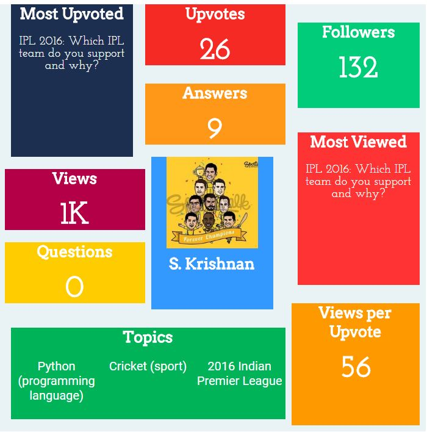

# Quora-Infograph
A JS script to produce infograph for quora users
Open Quora user profile page on Chrome and copy this code to the console.
It may take time depending on the number of answers and at the end produces a infograph about the user.

